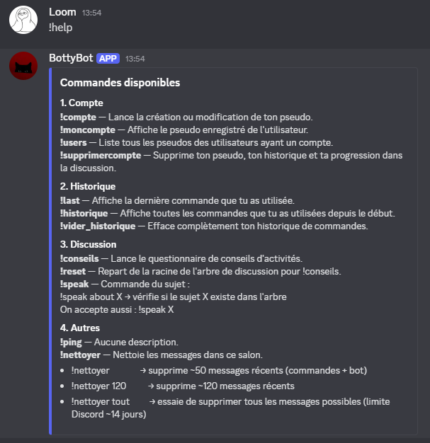
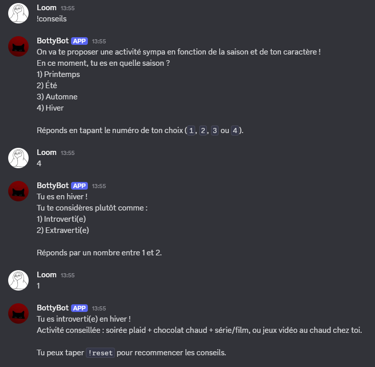
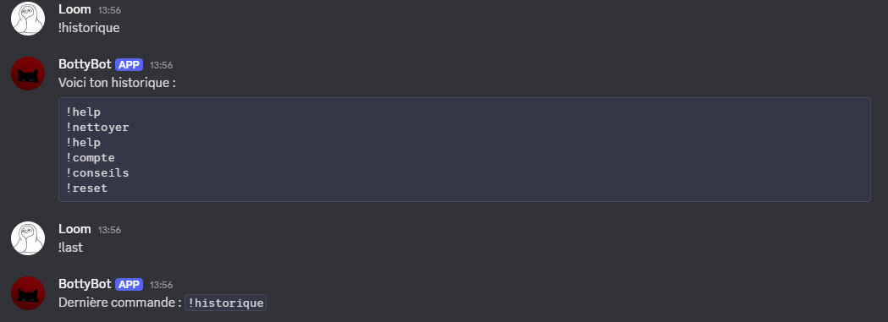
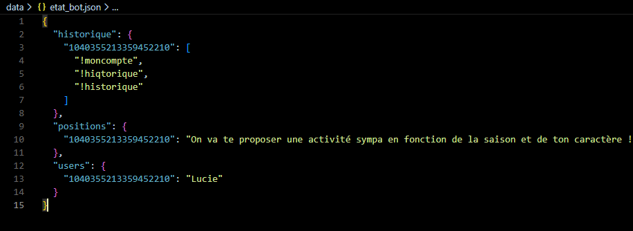

# Bot Discord – Projet de Rattrapage Python (B2)

## Présentation

Ce projet consiste à développer un bot Discord en Python répondant aux exigences du sujet de rattrapage :

- Structures de données implémentées manuellement (liste chaînée, arbre).
- Historique des commandes par utilisateur.
- Système de discussion basé sur un arbre de décision.
- Sauvegarde persistante des données.
- Fonctionnalités supplémentaires libres.

Le bot est organisé de manière modulaire pour séparer clairement la logique centrale, les commandes et les structures de données.

---

## Fonctionnalités principales

### 1. Historique des commandes (Liste chaînée)

- Enregistre automatiquement chaque commande saisie par un utilisateur.
- `!last` : affiche la dernière commande utilisée.
- `!historique` : affiche l'ensemble des commandes d’un utilisateur.
- `!vider_historique` : supprime l’historique d’un utilisateur.

### 2. Système de discussion (Arbre de décision)

- `!conseils` : lance une conversation guidée.
- L’utilisateur navigue dans un arbre en choisissant des réponses numérotées.
- `!reset` : retour à la racine de l’arbre.
- `!speak X` : indique si le sujet X existe dans l’arbre.

### 3. Sauvegarde persistante

Toutes les données importantes sont sauvegardées automatiquement :

- historique des utilisateurs
- progression dans l’arbre
- pseudo (profil) utilisateur

La sauvegarde est réalisée dans un fichier JSON au sein du dossier `data/`.

### 4. Fonctionnalités supplémentaires

#### Gestion de profil utilisateur

- `!compte` : crée ou modifie un pseudo.
- `!moncompte` : affiche le pseudo actuel.
- `!users` : liste les pseudo enregistrés.
- `!supprimercompte` : supprime le pseudo + toutes les données liées.

#### Nettoyage des messages

- `!nettoyer` : supprime les messages récents du bot et des commandes.
- `!nettoyer X` : supprime X messages.
- `!nettoyer tout` : supprime tous les messages autorisés par Discord (limite 14 jours).

#### Autres

- `!ping` : test de disponibilité du bot.

---

## Structure du projet

Bot_Rattrapage_Python/
│
├── commandes/ # Commandes regroupées par thème
│ ├── compte.py
│ ├── historique.py
│ ├── discussion.py
│ └── utils.py
│
├── structure_data/ # Structures de données implémentées à la main
│ ├── historique.py # Liste chaînée
│ ├── arbre.py # Arbre de décision
│ └── sauvegarde.py # Gestion de la sauvegarde JSON
│
├── data/ # Données sauvegardées (non versionnées)
│ └── etat_bot.json
│
├── main.py # Logique centrale du bot
├── start.py # Point d'entrée du programme
├── requirements.txt # Dépendances Python
├── .env # Token Discord (non versionné)
└── .gitignore

---

## Installation

### Prérequis

- Python 3.10 ou supérieur
- pip

### Installation des dépendances

pip install -r requirements.txt

### Configuration du token Discord

Le .env contenant le token n'étant pas fourni pour des raisons de sécurité, il faut :

- Créer un fichier `.env` à la racine du projet puis y entrer la ligne suivant :

        -> DISCORD_TOKEN=VOTRE_TOKEN_ICI

### Lancement du bot

py start.py

---

## Liste des commandes

### Gestion du compte
- `!compte`
- `!moncompte`
- `!users`
- `!supprimercompte`

### Historique
- `!last`
- `!historique`
- `!vider_historique`

### Discussion / Conseils
- `!conseils`
- `!reset`
- `!speak <sujet>`

### Utilitaires
- `!ping`
- `!nettoyer`
- `!nettoyer X`
- `!nettoyer tout`

---

## Aperçu des fonctionnalités

### Interface de la commande !help

#### Commande Help

### Gestion d’un compte utilisateur

#### Créer le compte

#### Supprimer le compte

### Arbre de discussion (commande !conseils)

#### Démarrage de la discussion

#### Check des sujet que contient l'arbre

### Historique

### Nettoyage des commandes et réponses du Bot

### Sauvegarde du bot (positiond dans l'arbre, Compte...

## Choix d’implémentation

- Projet structuré de manière modulaire pour une meilleure lisibilité.
- Commandes regroupées dans un dossier dédié.
- Sauvegarde automatique à l’arrêt du programme.

---------------------------------------------------------------------------

Projet réalisé dans le cadre du rattrapage Python B2.
